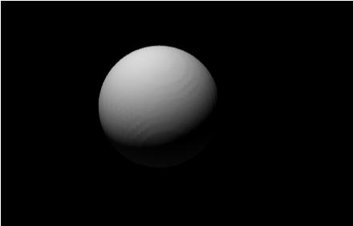

# implicit-mesh
Create simplicial complex meshes from an implicit function.

# example

``` js
const build = require('implicit-mesh')

const parameters = {
  resolution: 64,
  domain: [[-1, 1], [-1, 1], [-1, 1], [-1, 1]],
  dimension: 4
}

const mesh = build(function (x,y,z) {
  return x*x + y*y + z*z + w*w - 0.2
}, parameters)

console.log(JSON.stringify(mesh))
```

Or using a shader (not supported for dimension=4):

``` js
const build = require('implicit-mesh/shader')
const mesh = build(64, `
  float surface (vec3 p) {
    return length(p) - 0.5;
  }
`)
console.log(JSON.stringify(mesh))
```

Either way, you can use [meshview][3]:

```
$ electron-spawn shader.js | meshview
$ node js.js | meshview
```



[3]: https://npmjs.com/package/meshview

# api

``` js
var js = require('implicit-mesh')
var shader = require('implicit-mesh/shader')
```

## var mesh = js(opts, fn)

Build a 3d `mesh` with resolution `opts.size` from an implicit function
`fn(x,y,z)`.

If `opts` is a number of array, it is interpreted as the `opts.size`.

`opts.size` can be a number or an array of numbers, one for each coordinate.

The `f(x,y,z)` coordinates are in the domain `[-1,1]` and the resulting mesh
coordinates are in the range `[-1,1]` in each dimension.

simplicial complex meshes have:

* `mesh.positions` - an array of position arrays
* `mesh.cells` - an array of arrays of position indicies comprising a face

To get the surface normals you can use the [angle-normals][2] package:

``` js
var angleNormals = require('angle-normals')
var normals = angleNormals(mesh.cells, mesh.positions)
```

## var mesh = shader(opts, src)

Build a mesh from a glsl function defined in the string `src` and:

* `opts.size` - resolution to sample the implicit
* `opts.precision` - default: 'medium'

You should define a function `float surface(vec3 pos)`.

# install

```
npm install implicit-mesh
```

# license

BSD
